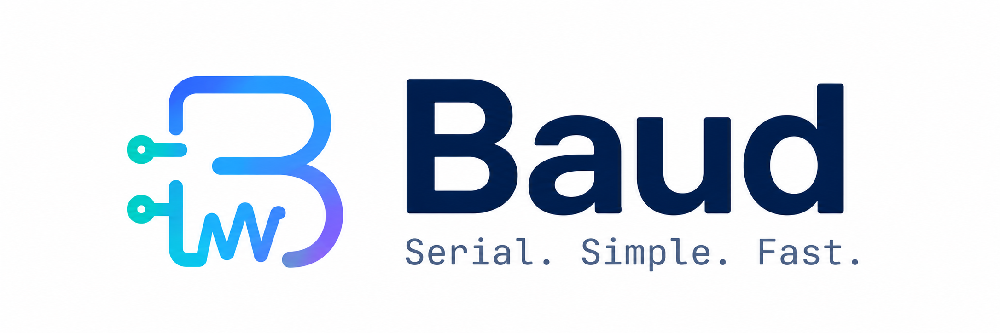
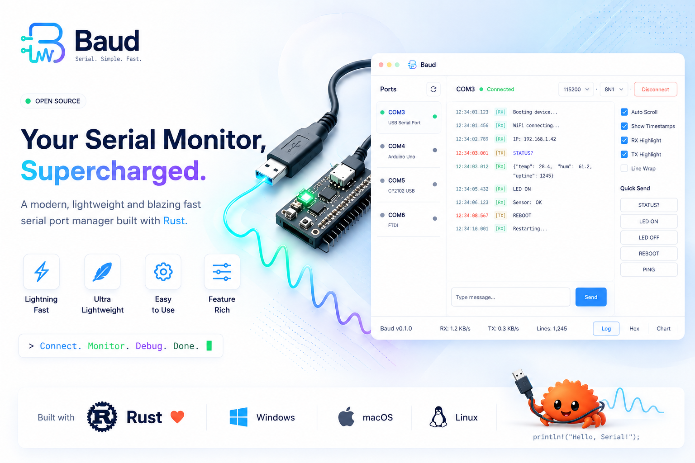

<p align="center">
  
</p>

<p align="center">
  <b>A modern, lightweight, blazing-fast serial terminal for debugging IoT devices.</b>
</p>

<p align="center">
  <a href="https://github.com/bkrajendra/Baud/actions/workflows/release.yml"></a>
  <a href="LICENSE"></a>
  
  
</p>

<p align="center">
  
</p>

> The image above shows the direction Baud is headed. The Features section
> below lists exactly what's implemented today.

## Why Baud?

Every time I needed to debug an ESP32 or Arduino over serial, I went looking
for a decent open-source serial monitor and came away frustrated — bloated
Electron apps, terminals that didn't remember basic things like timestamps,
or tools that just felt like an afterthought bolted onto something else.

So I built the one I wanted: a native, single-purpose serial terminal in
Rust. No Electron, no bundled runtime, no unnecessary features — just fast
startup, a small binary, and a clean way to watch your device talk.

## Features (v0.1)

- **Auto-detected COM ports** — pick from a live-scanned list, with a manual
  refresh button for devices plugged in after launch
- **Standard + custom baud rates** — 9600 through 230400 in a dropdown, or
  select "Custom" to enter any rate your device needs
- **Live terminal view** — streamed serial output rendered as it arrives,
  with autoscroll you can pause to read back through history
- **Optional per-line timestamps** — toggle `[HH:MM:SS.mmm]` prefixes on or off
- **Configurable line endings on send** — None / `\n` / `\r` / `\r\n`, so you
  can match whatever your firmware expects
- **Dark and light themes**
- **Non-blocking I/O** — serial reads happen on a background thread, so the
  UI never freezes regardless of baud rate or a silent device

## Roadmap

Baud is early. Things planned but not yet built:

- Hex view / binary inspection
- RX/TX color highlighting and line wrap toggle
- Saving terminal output to a log file
- Quick-send command macros
- Auto-reconnect on device replug

Contributions and feature requests are welcome — see [Contributing](#contributing).

## Install

Prebuilt binaries for Windows, macOS, and Linux are published on the
[Releases page](https://github.com/bkrajendra/Baud/releases) for every
version. Download the archive for your platform, extract it, and run the
`baud` (or `baud.exe`) binary — no installer required.

## Building from source

Requires a Rust toolchain with edition 2024 support (Rust 1.85+).

```bash
git clone https://github.com/bkrajendra/Baud.git
cd Baud
cargo build --release
```

On Linux, the build additionally needs the following system packages
(Debian/Ubuntu names shown; adjust for your distro):

```bash
sudo apt-get install -y libudev-dev libxkbcommon-dev libgtk-3-dev
```

The compiled binary is at `target/release/baud` (`target\release\baud.exe`
on Windows).

## Usage

1. Plug in your device and launch Baud.
2. Pick its port from the **Port** dropdown (click **Refresh** if it just
   appeared) and select a **Baud** rate — 115200 covers most ESP32/Arduino
   boards.
3. Click **Connect**. Output starts streaming into the terminal pane.
4. Type into the bottom input bar and press **Enter** (or click **Send**) to
   write back to the device. Pick the line ending your firmware expects from
   the dropdown next to it.
5. Click **Disconnect** when you're done — the port is released immediately
   so you can reflash the device or reconnect elsewhere.

## Contributing

Issues and pull requests are welcome. If you're proposing a larger change,
please open an issue first to discuss the approach.

## License

Baud is licensed under the [MIT License](LICENSE).
